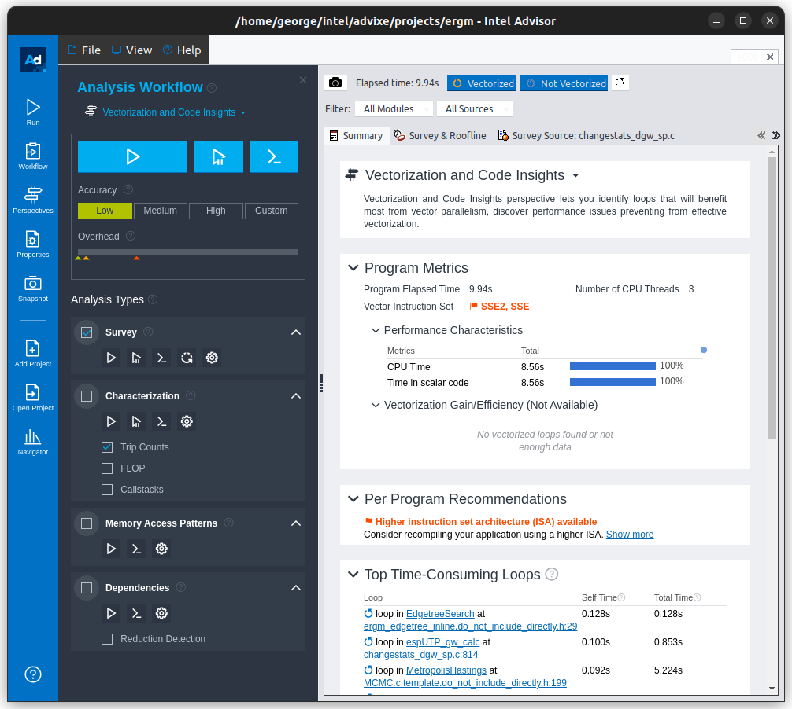
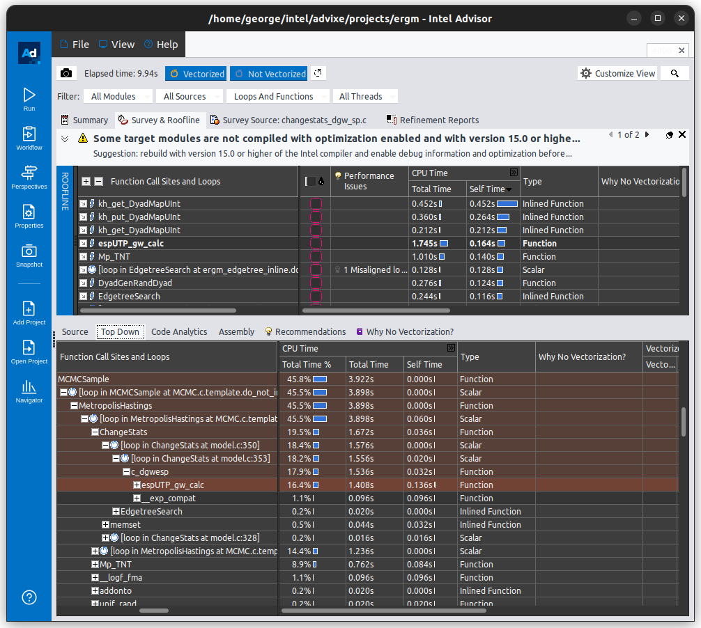
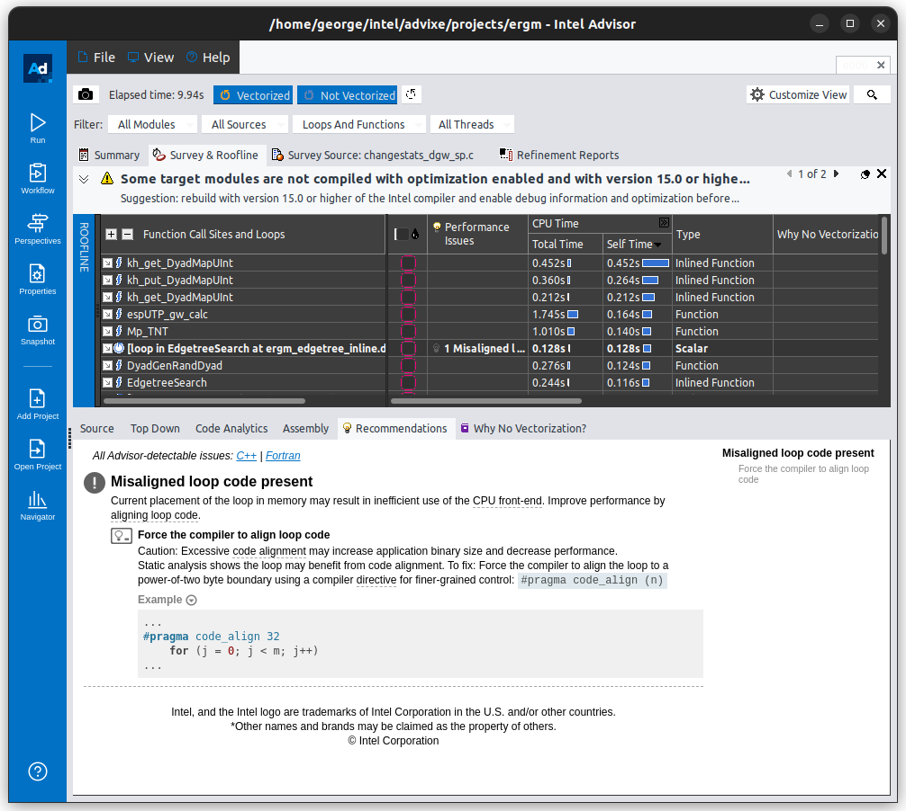

# ERGM OneAPI Profiling with Intel Advisor

This repository serves as an example of how to use Intel Advisor for code profiling of the R ERGM (Exponential Random Graph Models) package.

# Getting Started

These instructions will get you a copy of the project up and running on your local machine for development and testing purposes.

## Prerequisites

- R
- ERGM package
- Intel Advisor

## Running the Script

The main script is `example.sh` which is located in the `.` directory. This script runs an R script named `example.R`.

To run the script, navigate to the directory containing the script and execute the following command:

```shellscript
./example.sh
```

The advisor can be executed as follows:

```sh
advisor -collect survey -project-dir /path/to/project --app-working-dir=/path/to/example.sh-folder/ -- /path/to/example.sh
```

# Example outputs

Here is what a typical output from Intel Advisor looks like:







# Session info

```
R version 4.3.1 (2023-06-16)
Platform: x86_64-pc-linux-gnu (64-bit)
Running under: Ubuntu 22.04.3 LTS

Matrix products: default
BLAS:   /usr/lib/x86_64-linux-gnu/atlas/libblas.so.3.10.3 
LAPACK: /usr/lib/x86_64-linux-gnu/atlas/liblapack.so.3.10.3;  LAPACK version 3.10.0

locale:
 [1] LC_CTYPE=en_US.UTF-8       LC_NUMERIC=C              
 [3] LC_TIME=en_US.UTF-8        LC_COLLATE=en_US.UTF-8    
 [5] LC_MONETARY=en_US.UTF-8    LC_MESSAGES=en_US.UTF-8   
 [7] LC_PAPER=en_US.UTF-8       LC_NAME=C                 
 [9] LC_ADDRESS=C               LC_TELEPHONE=C            
[11] LC_MEASUREMENT=en_US.UTF-8 LC_IDENTIFICATION=C       

time zone: America/Denver
tzcode source: system (glibc)

attached base packages:
[1] stats     graphics  grDevices utils     datasets  methods   base     

other attached packages:
[1] ergm_4.6-7262  network_1.18.1

loaded via a namespace (and not attached):
 [1] trust_0.1-8              vctrs_0.6.3              cli_3.6.1               
 [4] rlang_1.1.1              DEoptimR_1.1-3           purrr_1.0.2             
 [7] glue_1.6.2               lpSolveAPI_5.5.2.0-17.10 rle_0.9.2               
[10] fansi_1.0.5              grid_4.3.1               tibble_3.2.1            
[13] MASS_7.3-60              fastmap_1.1.1            lifecycle_1.0.3         
[16] memoise_2.0.1            compiler_4.3.1           robustbase_0.99-0       
[19] coda_0.19-4              pkgconfig_2.0.3          statnet.common_4.9.0    
[22] lattice_0.21-9           utf8_1.2.3               pillar_1.9.0            
[25] Rdpack_2.5               parallel_4.3.1           rbibutils_2.2.15        
[28] magrittr_2.0.3           Matrix_1.6-1.1           tools_4.3.1             
[31] cachem_1.0.8 
```